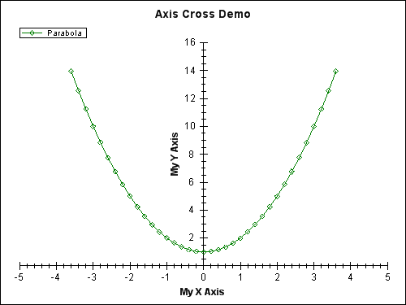
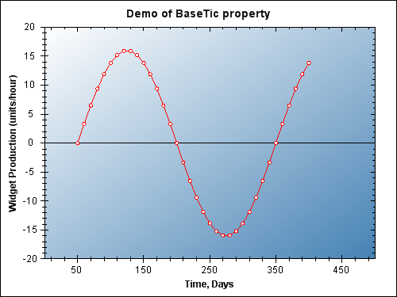
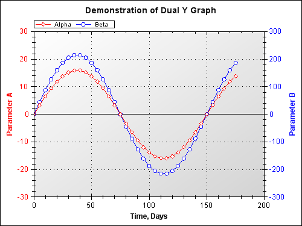
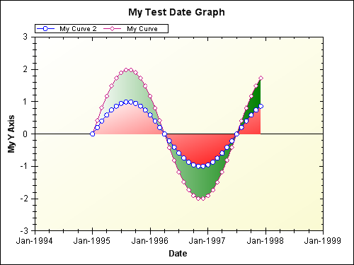
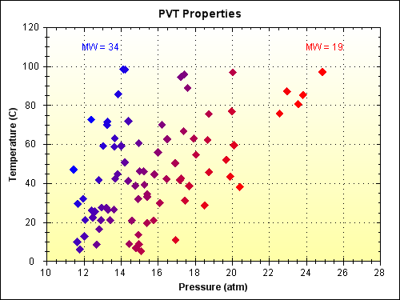
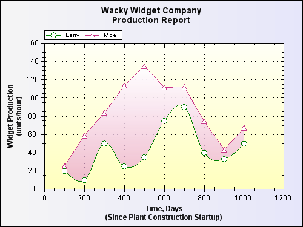
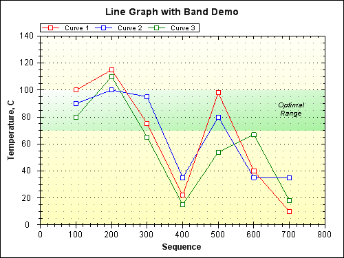
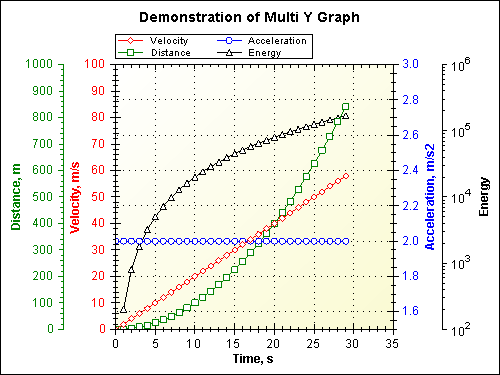
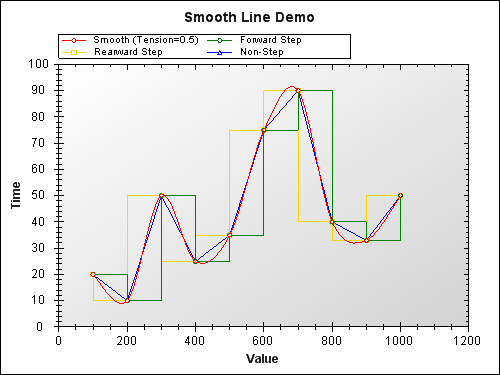
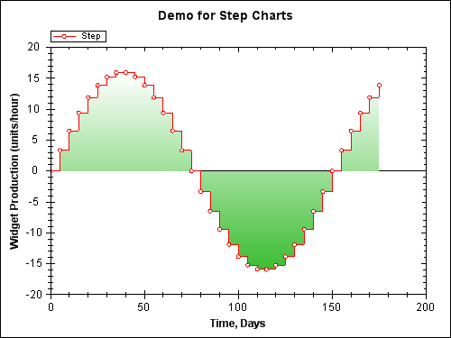

# ZedGraph

*The charting library for .NET*

created by John Champion

  
Screenshots

  

  

  

  

  

  

  

  

  

  

forked from https://sourceforge.net/projects/zedgraph/

ZedGraph is a class library, user control, and web control for
.NET, written in C#, for drawing 2D Line, Bar, and Pie Charts.
It features full, detailed customization capabilities, but most
options have defaults for ease of use.

## Download

ZedGraph is available via NuGet:
- [ZedGraph](http://nuget.org/packages/ZedGraph)
- [ZedGraph.WinForms](http://nuget.org/packages/ZedGraph.WinForms)

## TODO
* ~~port to .NET Core 6~~
* ~~sign assemblies~~
* ~~company+author+copyright credits~~
* xml docs

